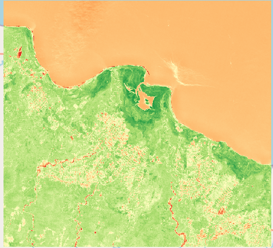
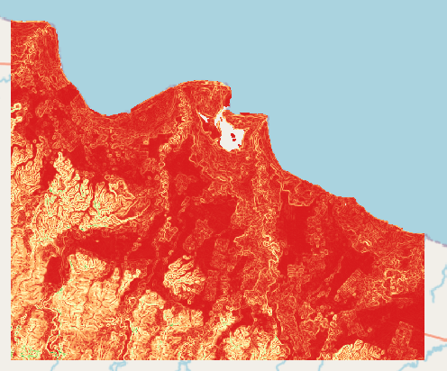
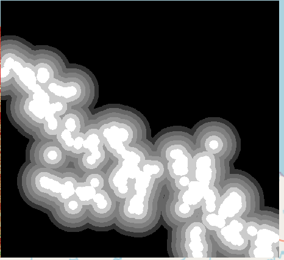
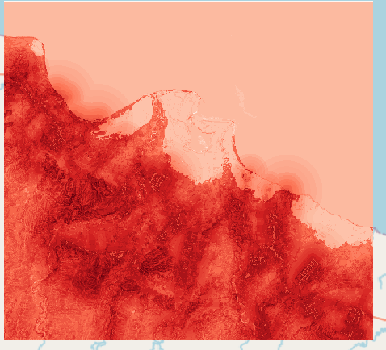
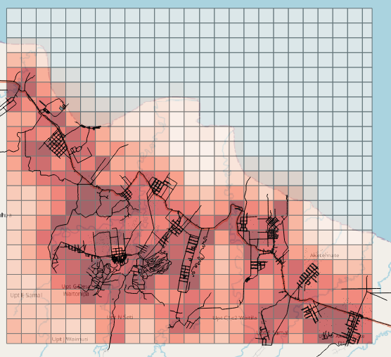

# 📊 Project: Create fire risk map using QGIS and remote sensing
Course : https://courses.gisopencourseware.org/course/section.php?id=574

This project implements a comprehensive workflow to evaluate forest fire risk using remote sensing data. The final outputs are risk assessment maps and grids designed to support fire prevention and management efforts.

## 🔄 Workflow
The methodology is standardized into 4 main phases:

  
   <em>Data Processing Workflow in QGIS</em>

---

## 🖼️ Intermediate Results
Before reaching the final risk maps, the project processes and extracts several key indices:

| NDMI (Moisture Index) | Slope Analysis | Infrastructure Buffers |
|:---:|:---:|:---:|
|  |  |  |
| *Assessing vegetation moisture* | *Determining terrain slope* | *Distance to roads* |

---

## 🏆 Final Outputs

These are the primary results obtained after conducting the **Weighted Overlay Analysis**.

### 1. Fire Risk Map
A continuous Raster map illustrating the level of fire risk from low to high across the study area.

  

### 2. Fire Risk Grid
The data is vectorized and aggregated using **Zonal Statistics**, creating a grid system that helps managers easily locate and prioritize high-risk zones.

  

---

## 🛠️ Tools & Data Sources
* **Software:** QGIS 3.x
* **Input Data:** * Sentinel-2 Imagery (Copernicus Browser)
    * DEM (Open Topography)
    * Land Cover (ESA World Cover)
    * Road and Building Vectors (OpenStreetMap - OSM)
* **Core Algorithms:** Raster Calculator, Multi-Ring Buffer, Weighted Overlay, Reclassify, Zonal Statistics.

## 📁 Repository Structure & Instructions
1. Raw and processed data layers are located in the `/data` directory.
2. Processing map outputs are stored in `/processing` directory
2. Final map outputs are exported to the `/result` directory.
3. To view the interactive map, open the `Fire_risk_map.qgz` file in QGIS.

---
*Author: Minh Duc Ha*
